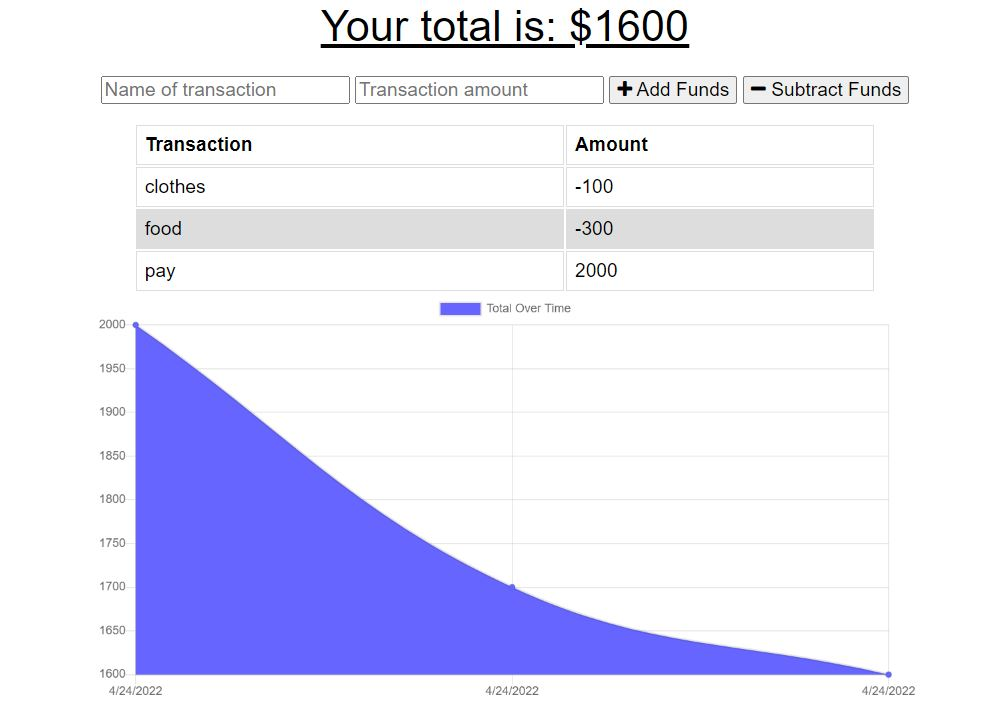

# Money-Tracker

## Description

This is a PWA website that can be used online or offline. The website allows the user to enter in amounts of money they have obtaine or spent to keep track of their spending habits. You can visit the website at https://immense-gorge-23777.herokuapp.com/.

## Installation

To get the deployment enviroment to run, simply click on the link below.
https://immense-gorge-23777.herokuapp.com/

## Usage

This website is used to help a person keep track of their general spending habits and help them stay in their budget.

## Credits

- Sabrina Zanin: https://github.com/Brinabean
- CWRU Coding Bootcamp Module 19

## Utilizes:

- JavaScript
- Express
- NOSQL
- Mongoose
- PWA

### License

MIT License

Copyright (c) 2022 Sabrina Zanin

Permission is hereby granted, free of charge, to any person obtaining a copy
of this software and associated documentation files (the "Software"), to deal
in the Software without restriction, including without limitation the rights
to use, copy, modify, merge, publish, distribute, sublicense, and/or sell
copies of the Software, and to permit persons to whom the Software is
furnished to do so, subject to the following conditions:

The above copyright notice and this permission notice shall be included in all
copies or substantial portions of the Software.

THE SOFTWARE IS PROVIDED "AS IS", WITHOUT WARRANTY OF ANY KIND, EXPRESS OR
IMPLIED, INCLUDING BUT NOT LIMITED TO THE WARRANTIES OF MERCHANTABILITY,
FITNESS FOR A PARTICULAR PURPOSE AND NONINFRINGEMENT. IN NO EVENT SHALL THE
AUTHORS OR COPYRIGHT HOLDERS BE LIABLE FOR ANY CLAIM, DAMAGES OR OTHER
LIABILITY, WHETHER IN AN ACTION OF CONTRACT, TORT OR OTHERWISE, ARISING FROM,
OUT OF OR IN CONNECTION WITH THE SOFTWARE OR THE USE OR OTHER DEALINGS IN THE
SOFTWARE.
